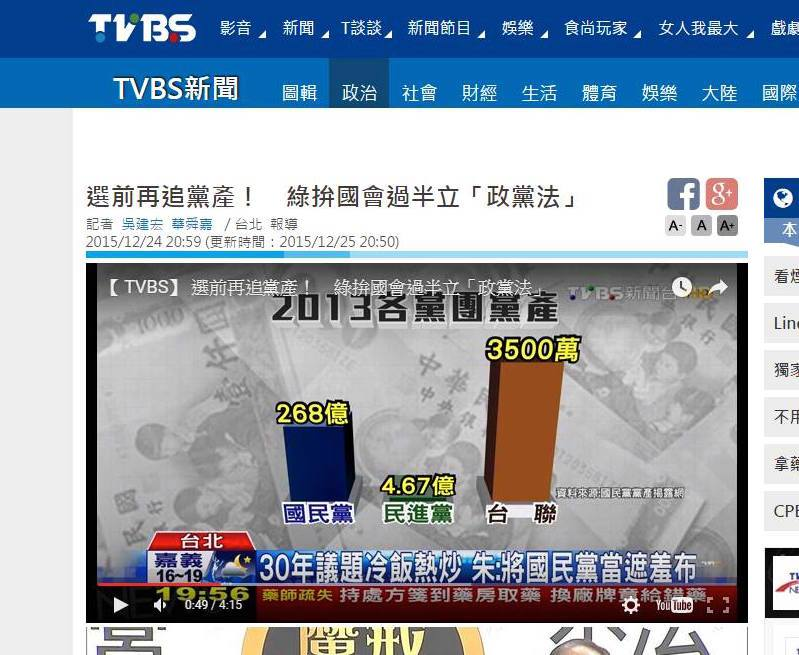

# 如何使用R正確視覺化台灣政黨黨產
Yao-Jen Kuo  
Sunday, December 27, 2015  

# 簡介

TVBS新聞在2015/12/24 20:59(更新時間 2015/12/25 20:50)發布的新聞**選前再追黨產! 綠拚國會過半立政黨法**中，利用Bar Chart做了黨產的視覺化，一時廣為網友流傳，帶來許多歡樂:



本文章介紹如何使用R正確視覺化台灣政黨黨產。

---

# 資料

繪圖之前要找資料，TVBS的黨產資料同樣來自**內政部民政司**網站中的[103 年政黨財務申報](http://www.moi.gov.tw/dca/03caucus_10301.aspx)，其中該年度有會計師簽證的政黨只有四個：中國國民黨、民主進步黨、親民黨與台灣團結聯盟(順序依編號，由小至大。)


```r
Sys.setlocale(category = "LC_ALL", locale = "cht")
```

```
## [1] "LC_COLLATE=Chinese (Traditional)_Taiwan.950;LC_CTYPE=Chinese (Traditional)_Taiwan.950;LC_MONETARY=Chinese (Traditional)_Taiwan.950;LC_NUMERIC=C;LC_TIME=Chinese (Traditional)_Taiwan.950"
```

```r
parties <- c("中國國民黨","民主進步黨","親民黨","台灣團結聯盟")
partiesEn <- c("KMT", "DPP", "PFP", "TSU")
assetInMillionNTD <- c(25570, 479, 3, 21)
color <- c("blue", "green", "orange", "goldenrod")
partiesAsset <- data.frame(parties, partiesEn, assetInMillionNTD, color)
```

---

# Packages

這次我們會用3種方式來做黨產視覺化，其中**Base Plotting System**是R內建的繪圖功能，使用前不需要安裝/讀取套件，但是ggplot2與plotly在使用前必須另外安裝/讀取套件。

* Base Plotting System
* ggplot2


```r
#install.packages("ggplot2")
library(ggplot2)
```

* plotly


```r
#install.packages("plotly")
library(plotly)
```

```
## 
## Attaching package: 'plotly'
## 
## The following object is masked from 'package:ggplot2':
## 
##     last_plot
## 
## The following object is masked from 'package:graphics':
## 
##     layout
```

---

# Visualization

* Base Plotting System


```r
basebp <- barplot(partiesAsset$assetInMillionNTD, names.arg=partiesAsset$parties, col=color, cex.names=0.8, border=NA, ylim=c(0,30000), main=paste("民國103年政黨財務申報(具會計師簽證)","\n","單位:新台幣百萬元"), sub="資料來源:內政部民政司")
text(x=basebp, y=partiesAsset$assetInMillionNTD, label=partiesAsset$assetInMillionNTD, pos = 3, cex = 0.8)
```

 

* ggplot2


```r
ggplotbp <- ggplot(data=partiesAsset, aes(x=partiesEn, y=assetInMillionNTD))+geom_bar(colour=NA, fill=c("green", "blue", "orange", "goldenrod"), width=.8, stat="identity")+ ggtitle(paste("民國103年政黨財務申報(具會計師簽證)","\n","單位:新台幣百萬元"))+ylab("")+xlab("資料來源:內政部民政司")+geom_text(aes(label=assetInMillionNTD), vjust = -0.5)
ggplotbp
```

 

* plotly


```r
plotlybp <- plot_ly(
  x=partiesEn,
  y=assetInMillionNTD,
  type="bar",
  color=partiesEn
  )
plotlybp
```

<!--html_preserve--><div id="htmlwidget-3754" style="width:864px;height:624px;" class="plotly"></div>
<script type="application/json" data-for="htmlwidget-3754">{"x":{"data":[{"type":"bar","inherit":true,"x":["KMT"],"y":[25570],"name":"KMT","marker":{"color":"#66C2A5"}},{"type":"bar","inherit":true,"x":["DPP"],"y":[479],"name":"DPP","marker":{"color":"#FC8D62"}},{"type":"bar","inherit":true,"x":["PFP"],"y":[3],"name":"PFP","marker":{"color":"#8DA0CB"}},{"type":"bar","inherit":true,"x":["TSU"],"y":[21],"name":"TSU","marker":{"color":"#E78AC3"}}],"layout":{"xaxis":{"title":"partiesEn"},"yaxis":{"title":"assetInMillionNTD"},"margin":{"b":40,"l":60,"t":25,"r":10}},"url":null,"width":null,"height":null,"base_url":"https://plot.ly","layout.1":{"xaxis":{"title":"partiesEn"},"yaxis":{"title":"assetInMillionNTD"}},"filename":"partiesEn vs. assetInMillionNTD"},"evals":[]}</script><!--/html_preserve-->

---
